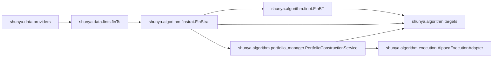

# Contributing

This document explains how the framework is structured and how to add features safely.

## Core architecture

The project has a clean data -> signal -> sizing -> execution split:



### Module responsibilities

- `shunya/data/providers.py`
  - External data access abstractions.
  - Includes OHLCV providers and yfinance classification lookup.
- `shunya/data/fints.py`
  - Builds the canonical panel (`Ticker`, `Date`) dataframe.
  - Adds engineered features and classification columns.
- `shunya/algorithm/finstrat.py`
  - Alpha pipeline: builds `AlphaContext`, computes raw scores, then optional decay, truncation, neutralization, and scaling.
- `shunya/algorithm/alpha_context.py`
  - Alpha authoring interface (`ctx.open/high/low/close/adj_volume`, `ctx.ts.*`, `ctx.cs.*`).
- `shunya/algorithm/finbt.py`
  - Backtrader wrapper for paper/research simulation.
- `shunya/algorithm/portfolio_manager.py`
  - **`PortfolioConstructionService`**: canonical target vs alpha blend construction and `PortfolioConstructionResult` diagnostics; legacy `PortfolioManager` / `AlphaBlendPortfolioManager` facades.
  - Rolling Sharpe bookkeeping from caller-supplied returns (optional `StrategyReturnFeed`).
- `shunya/algorithm/execution.py`
  - Broker-side guardrails, order submission, bounded status observation, and order cancellation hook.
- `shunya/algorithm/targets.py`
  - Shared target/delta/cap helpers used in backtest and live-style paths (gross/net caps, turnover budgets, ADV caps).
- `shunya/utils/indicators.py`
  - Dataframe feature names and compatibility constants.

## Design principles

- Keep logic shared between backtest and trading where possible (`targets.py`).
- Validate inputs at module boundaries and fail fast with clear errors.
- Preserve deterministic behavior (explicit fallbacks for missing classifications).
- Keep production-side operations observable (warnings and execution reports).
- Prefer pure functions for transforms and stateful classes only for orchestration.
- Preserve backtest/live parity by keeping risk controls in shared helper modules.

## Coding style and patterns

- Python 3.12+, type hints on public functions/classes.
- Keep functions small and single-purpose.
- Use dataclasses for structured outputs (`ExecutionReport`, `OrderAttempt` style).
- Use explicit names for finance concepts (`targets_usd`, `deltas_usd`, `gross_cap`).
- Avoid hidden global state.
- Keep docs and tests updated in the same change.

## Adding a new feature

Use this sequence to avoid regressions:

1. Define scope and API
   - Decide whether this is data-layer, signal-layer, target-layer, portfolio-layer, or execution-layer.
   - Add parameters with conservative defaults.
2. Implement in shared modules first
   - If both `FinBT` and portfolio/OMS paths need behavior, add helper(s) in `targets.py` or a shared module.
3. Wire into orchestrators
   - Add to `FinBT` and/or `PortfolioConstructionService` / your service-layer submit loop.
   - Surface decisions/warnings in reports.
4. Add tests
   - Unit tests for helper functions.
   - Behavioral tests for `FinBT` and execution adapters as appropriate.
5. Update docs
   - Add usage snippet and caveats in [`README.md`](README.md).

## Common extension recipes

### 0) Add or modify a market data provider

- Implement `MarketDataProvider.download(ticker_list, start, end, *, bar_spec=None, bar_index_policy=None) -> DataFrame`.
- Keep provider output contract stable:
  - index is `DatetimeIndex`, named `"Date"`, normalized per `bar_index_policy` (timezone + naive vs aware)
  - single ticker returns flat OHLCV columns
  - multiple tickers return MultiIndex columns as `(Ticker, Field)`
- Required OHLCV fields per symbol are `Open`, `High`, `Low`, `Close`, `Volume`.
- For strict workflows, prefer fail-fast semantics on missing symbols (current Alpaca provider behavior).
- Keep classification coupling explicit in call sites (`attach_yfinance_classifications` and `classifications`).

### 1) Add a new feature column to panels

- Add computation in `finTs._add_features`.
- Update `shunya/utils/indicators.py` constants and ordering.
- Add tests ensuring the column exists and is numeric/usable.
- If lookahead-sensitive, keep it out of live alpha context inputs.

### 2) Add a new neutralization/control mode

- Add cross-sectional transform in `cross_section.py` or helper in `targets.py`.
- Integrate in `FinStrat.pass_` and/or pre-trade enforcement path.
- Add tests for shape checks and edge behavior (all zeros, NaNs, one-name universe).

### 3) Add broker/execution safeguards

- Put broker-facing behavior in `execution.py`.
- Keep application orchestration (scheduling, reconciliation policy) in your own service code; use `ExecutionReport`-shaped summaries when helpful.

### 4) Add risk constraints

- Implement reusable math in `targets.py`.
- Wire constraint knobs into `FinBT` and/or your live pipeline after `PortfolioConstructionService.construct` / `net_targets`.
- Prefer deterministic `rescale` defaults; support `raise` for strict workflows.

### 5) Add decision/session rules

- Keep timestamp resolution in `decision.py`.
- Surface warnings from your orchestration layer when resolving `as_of`.
- Add tests for weekend/future/staleness/same-session behavior.

### 6) Trading-time axis changes

- Keep the default behavior backward-compatible unless the change is explicitly intended to be breaking:
  - `finTs(..., trading_axis_mode="observed")` follows observed panel timestamps.
  - `finTs(..., trading_axis_mode="canonical")` uses canonical US-equities trading bars.
- Use `shunya.data.timeframes` helpers for new time-axis logic:
  - `build_trading_calendar(...)`
  - `timestamp_is_on_trading_grid(...)`
  - `trading_time_distance(...)`
- For stricter provider contracts, use `strict_trading_grid=True` in `finTs` to reject off-grid timestamps and missing in-session bars.
- For strategy decay semantics:
  - `FinStrat(..., temporal_mode="bar_step")` = one-step-per-bar.
  - `FinStrat(..., temporal_mode="elapsed_trading_time")` = advance decay by trading-time distance.
  - Ensure execution orchestrators pass `execution_date` into `FinStrat.pass_` (already wired in `FinBT`).

## Testing expectations

Run (same as [`README.md`](README.md); add `-q` for quieter output):

```bash
uv sync --extra dev
# optional: `--extra notebook` for `ipykernel`, or `uv sync --all-extras`
uv run pytest
# or: uv run pytest -q
```

When changing critical paths, add tests in relevant files:

- Data layer: `tests/test_fints_classification.py`
- Data providers/contracts: `tests/test_providers.py`
- Data QA: `tests/test_data_qa.py`
- Signal/pipeline: `tests/test_finstrat.py`, `tests/test_cross_section.py`
- Operator libraries: `tests/test_time_series.py`, `tests/test_logical_ops.py`, `tests/test_group_ops.py`
- Backtest behavior: `tests/test_finbt.py`
- Target/risk helpers: `tests/test_targets.py`, `tests/test_constraints.py`
- Portfolio: `tests/test_portfolio_manager.py`
- Trading/execution: `tests/test_execution_adapter.py`
- End-to-end adapter flow: `tests/test_integration_rebalance.py`

## PR checklist

- [ ] Inputs validated and errors are actionable.
- [ ] Shared logic reused across `FinBT` and portfolio/OMS call sites where applicable.
- [ ] Warnings/reporting updated for new risk/execution behavior.
- [ ] Reconciliation behavior tested for residual and remediation paths when you change execution code.
- [ ] Tests added/updated and passing.
- [ ] [`README.md`](README.md) updated for user-facing changes.

## Notes on market data and fundamentals

- Current classification source is yfinance and may not be point-in-time stable.
- For production-grade attribution/constraints, consider a point-in-time vendor dataset and keep `Ticker` to stable security-id mapping externally.
