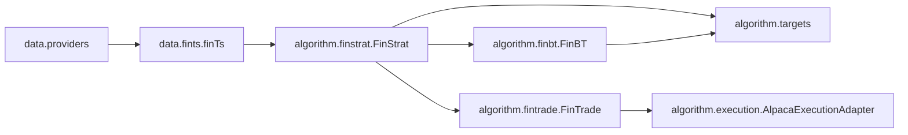

# Contribution Guide

This document explains how the framework is structured and how to add features safely.

## Core architecture

The project has a clean data -> signal -> sizing -> execution split:



### Module responsibilities

- `src/data/providers.py`
  - External data access abstractions.
  - Includes OHLCV providers and yfinance classification lookup.
- `src/data/fints.py`
  - Builds the canonical panel (`Ticker`, `Date`) dataframe.
  - Adds engineered features and classification columns.
- `src/algorithm/finstrat.py`
  - Alpha pipeline: raw scores, optional decay, truncation, neutralization, and scaling.
- `src/algorithm/finbt.py`
  - Backtrader wrapper for paper/research simulation.
- `src/algorithm/fintrade.py`
  - Live/paper order orchestration with broker deltas.
- `src/algorithm/execution.py`
  - Broker-side guardrails, order submission, bounded status observation, and order cancellation hook.
- `src/algorithm/targets.py`
  - Shared target/delta/cap helpers used in both backtest and trade paths (gross/net caps, turnover budgets, ADV caps).
- `src/utils/indicators.py`
  - Feature names and index constants (`COL`, `IX`, `IX_LIVE`).

## Design principles

- Keep logic shared between backtest and trading where possible (`targets.py`).
- Validate inputs at module boundaries and fail fast with clear errors.
- Preserve deterministic behavior (explicit fallbacks for missing classifications).
- Keep production-side operations observable (warnings and execution reports).
- Prefer pure functions for transforms and stateful classes only for orchestration.
- Preserve backtest/live parity by keeping risk controls in shared helper modules.

## Coding style and patterns

- Python 3.12+, type hints on public functions/classes.
- Keep functions small and single-purpose.
- Use dataclasses for structured outputs (`ExecutionReport`, `OrderAttempt` style).
- Use explicit names for finance concepts (`targets_usd`, `deltas_usd`, `gross_cap`).
- Avoid hidden global state.
- Keep docs and tests updated in the same change.

## Adding a new feature

Use this sequence to avoid regressions:

1. Define scope and API
   - Decide whether this is data-layer, signal-layer, target-layer, or execution-layer.
   - Add parameters with conservative defaults.
2. Implement in shared modules first
   - If both `FinBT` and `FinTrade` need behavior, add helper(s) in `targets.py` or a shared module.
3. Wire into orchestrators
   - Add to `FinBT` and/or `FinTrade` interfaces.
   - Surface decisions/warnings in reports.
4. Add tests
   - Unit tests for helper functions.
   - Behavioral tests for `FinBT`/`FinTrade`.
5. Update docs
   - Add usage snippet and caveats in `README.md`.

## Common extension recipes

### 0) Add or modify a market data provider

- Implement `MarketDataProvider.download(ticker_list, start, end) -> DataFrame`.
- Keep provider output contract stable:
  - index is `DatetimeIndex`, daily-normalized, named `"Date"`
  - single ticker returns flat OHLCV columns
  - multiple tickers return MultiIndex columns as `(Ticker, Field)`
- Required OHLCV fields per symbol are `Open`, `High`, `Low`, `Close`, `Volume`.
- For strict workflows, prefer fail-fast semantics on missing symbols (current Alpaca provider behavior).
- Keep classification coupling explicit in call sites (`attach_yfinance_classifications` and `classifications`).

### 1) Add a new feature column to panels

- Add computation in `finTs._add_features`.
- Update `src/utils/indicators.py` constants and ordering.
- Add tests ensuring the column exists and is numeric/usable.
- If lookahead-sensitive, ensure `IX_LIVE` exclusion rules are correct.

### 2) Add a new neutralization/control mode

- Add cross-sectional transform in `cross_section.py` or helper in `targets.py`.
- Integrate in `FinStrat.pass_` and/or pre-trade enforcement path.
- Add tests for shape checks and edge behavior (all zeros, NaNs, one-name universe).

### 3) Add broker/execution safeguards

- Put broker-facing behavior in `execution.py`.
- Keep `FinTrade` orchestration thin and report-centric.
- Ensure failures are reflected in `ExecutionReport.warnings` and attempt fields.

### 4) Add risk constraints

- Implement reusable math in `targets.py`.
- Wire constraint knobs in both `FinBT` and `FinTrade`.
- Prefer deterministic `rescale` defaults; support `raise` for strict workflows.

### 5) Add decision/session rules

- Keep timestamp resolution in `decision.py`.
- Keep orchestration warnings in `FinTrade.run`.
- Add tests for weekend/future/staleness/same-session behavior.

## Testing expectations

Run:

```bash
uv sync --extra dev
uv run pytest -q
```

When changing critical paths, add tests in relevant files:

- Data layer: `tests/test_fints_classification.py`
- Data providers/contracts: `tests/test_providers.py`
- Data QA: `tests/test_data_qa.py`
- Signal/pipeline: `tests/test_finstrat.py`, `tests/test_cross_section.py`
- Backtest behavior: `tests/test_finbt.py`
- Target/risk helpers: `tests/test_targets.py`, `tests/test_constraints.py`
- Trading/execution: `tests/test_fintrade.py`, `tests/test_execution_adapter.py`
- End-to-end rebalance flow: `tests/test_integration_rebalance.py`

## PR checklist

- [ ] Inputs validated and errors are actionable.
- [ ] Shared logic reused across `FinBT` and `FinTrade`.
- [ ] Warnings/reporting updated for new risk/execution behavior.
- [ ] Reconciliation behavior tested for residual and remediation paths.
- [ ] Tests added/updated and passing.
- [ ] `README.md` updated for user-facing changes.

## Notes on market data and fundamentals

- Current classification source is yfinance and may not be point-in-time stable.
- For production-grade attribution/constraints, consider a point-in-time vendor dataset and keep `Ticker` to stable security-id mapping externally.
