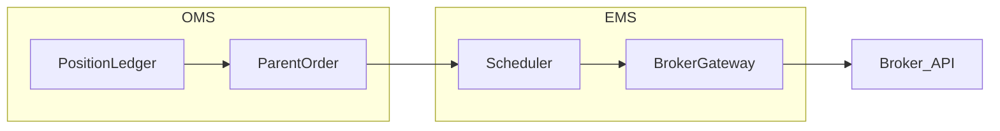

# OMS, EMS, and order routing

For class names (`InstitutionalOMS`, `EMSParentRunner`, `AlpacaExecutionAdapter`, …) and env vars, see [Execution: OMS, EMS, live desk](../documentation/oms-ems.md).

## Order management (OMS)

The **OMS** owns the **business lifecycle** of orders:

- **Parent orders** — what the portfolio manager *intends* (e.g. “buy \$1M SPY vs arrival price”).
- **State machine** — accepted → working → partially filled → done / canceled / rejected.
- **Book and reconciliation** — positions vs custodian, cash, corporate actions (conceptually).

In Shunya, **`shunya.oms`** implements an **institutional-style** parent FSM, ledger, and share reconciliation vs USD targets, with optional **Postgres** persistence.

## Execution management (EMS)

The **EMS** decides **how** parent intent becomes **child orders** on venues:

- **Scheduling** — TWAP/VWAP slices, participation rates.
- **Venue and order type choice** — market vs limit vs peg, odd lots, etc.
- **Microstructure guardrails** — price limits relative to micro-price, throttles.

Shunya **`shunya.ems`** provides **`BrokerGateway`** / **`AlpacaBrokerGateway`**, schedulers, and **`EMSParentRunner`** for child lifecycle.

## From signal to order (conceptual chain)

1. **Alpha / model** produces scores or desired weights.
2. **Portfolio construction** turns scores into **target weights or notionals**.
3. **Risk** vets or scales targets (**`PortfolioRiskEngine`**).
4. **OMS** turns targets into **parent orders** and tracks state.
5. **EMS** splits parents into **children** and sends them to the **broker API**.
6. **Broker** matches, fills, and reports executions back for reconciliation.

Shunya’s HTTP **`POST /trade/paper/cycle`** exercises a **subset** of this chain for **paper** accounts when Alpaca is enabled.

## Alpaca order types (overview)

Alpaca supports multiple **equity order types** and parameters; exact flags evolve with the broker API. Typical categories:

| Type | When it is used |
|------|-----------------|
| **Market** | Max certainty of fill; pay spread / impact. |
| **Limit** | Price cap/floor; non-marketable rests in book. |
| **Stop / stop-limit** | Trigger on price; used for exits or breakout entries. |
| **Trailing stop** | Stop price follows favorable movement. |

Authoritative, up-to-date detail: [Alpaca trading API docs](https://docs.alpaca.markets/docs/trading/orders).

## Further reading

- [Pipeline: alpha to execution](pipeline-alpha-to-execution.md)
- [Paper trading cycle (API)](../how-to/paper-cycle-api.md)
