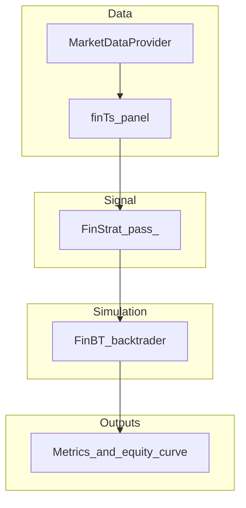
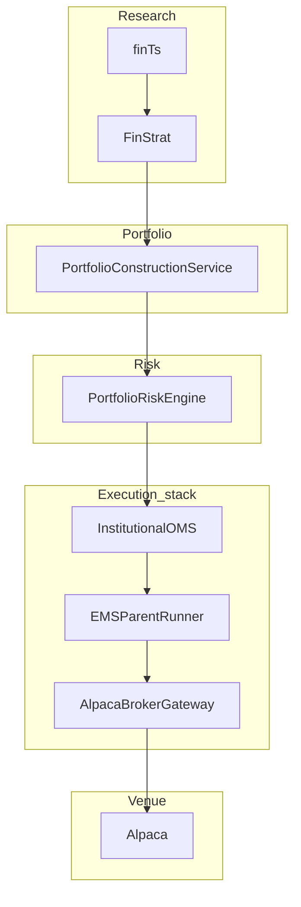
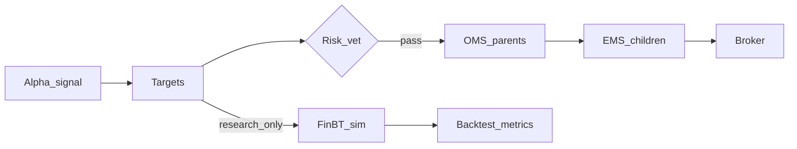

# Pipeline: alpha to execution

This page ties together **research**, **simulation**, **portfolio construction**, **risk**, and **broker execution** as Shunya models them. For code-level wiring, see [Documentation](../documentation/system-overview.md) and [OMS / EMS](../documentation/oms-ems.md).

## Research and simulation path (library + HTTP backtest)

- **`finTs`** builds the panel; **`FinStrat`** maps `algorithm(ctx)` to targets each bar; **`FinBT`** applies broker-like **costs** and produces **`results`**.

When you use the **FastAPI** service, the **worker** runs the same broad idea: persisted alpha + config → simulation job → JSON results for the UI.

## Live and paper path (desk + OMS + EMS)

**`InstitutionalPaperDesk`** wires **PCS → PRE → OMS → EMS** with the Alpaca stream for a **paper** cycle; **`shunya-paper`** exposes a CLI entry point.

## One diagram: both worlds

- **Left branch:** production-style **risk → OMS → EMS → broker** (live or paper).
- **Right branch:** **FinBT** for historical **what-if** without sending orders.

## Further reading

- [Alphas, metrics, and evaluation](alphas-metrics-and-evaluation.md)
- [Portfolios, construction, and PMS](portfolios-construction-and-pms.md)
