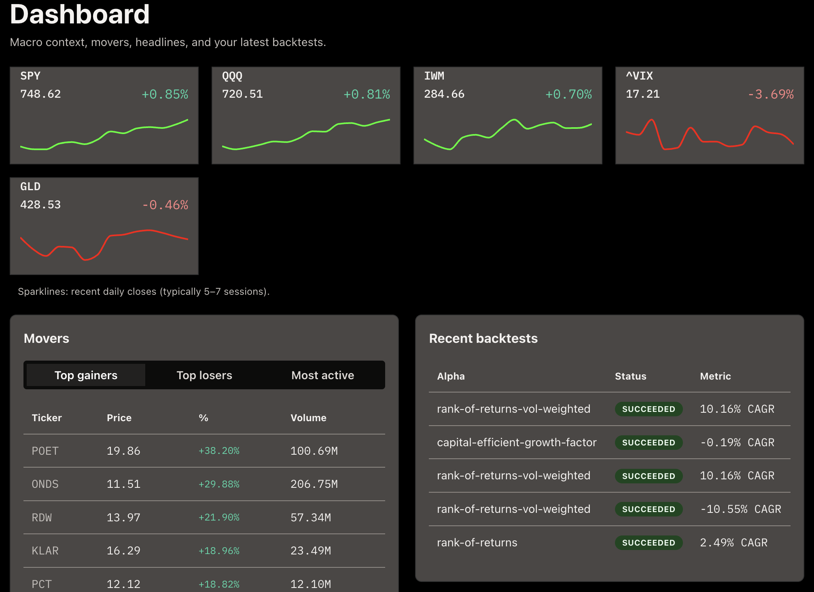

# Research area (sidebar)

Routes under **Research** in the UI shell (`ui/src/components/SideNav.tsx`).

## Service root (`/`) — landing

The root URL is a **static** landing screen (no sidebar, no API calls): Matrix-style presentation, feature copy, a link to the [documentation site](https://kaushikdey647.github.io/shunya/), and a call-to-action into the app shell at **`/dashboard`**.

## Dashboard (`/dashboard`)

Dashboard cards: macro strip, movers, market headlines, recent backtests feed, health mini-card, and a **watchlist**.

**Watchlist** uses **`POST /market/snapshot`** and persists tickers in **`localStorage`** (`shunya_watchlist_v1`). It is browser-local until a server-backed watchlist exists.

## Search (`/search`)

Ticker and instrument search; results link into instrument detail where applicable.

## Data summary (`/data`)

Coverage and analytics views driven by **`POST /data`**, **`GET /data/dashboard`**, and related API routes. Expect richer behavior when **`DATABASE_URL`** is configured on the API.

The page shows KPIs, sector/industry pies, **risk vs log total return** (**`log_return_pct`** from the API: **`100 * ln(c_last / c_first)`** when both endpoint closes are positive; scatter positions use **1–99% winsorization** on vol and log return so outliers do not compress the cloud), a completeness histogram, and a **missing-coverage** pie: inverted completeness (**100% − completeness %**) for the **ten** tickers with the largest gaps (no per-ticker heatmap or full instrument table).

## Settings (`/settings`)

- **App / runtime** — reads **`GET /settings/app`** (effective tunables and sources). Patches require the same **`X-Shunya-Trade-Desk-Token`** as the trade desk when **`SHUNYA_API_TRADE_DESK_TOKEN`** is set on the API (see [HTTP API (overview)](../reference/http-api-package.md)).
- **Alpaca** — broker-facing configuration in the UI when the API exposes Alpaca integration; uses the trade-desk token for privileged routes.

**Mock vs live:** several **Trade** pages still use **`localStorage`** (`shunya_trade_desk_v1`) for hub/tracer/risk mock state until additional HTTP routes land. **Account** and **Settings → Alpaca** paths call real **`/trade/...`** proxies when Alpaca is enabled on the API.

## Instrument detail (`/instruments/:symbol`)

OHLCV charts and panels fed by **`/instruments/...`** routes (Timescale when complete coverage exists, otherwise yfinance with optional write-back). The **Chart & news** tab is historical Yahoo/Timescale OHLCV plus news context.

**Live Data** is a separate tab: realtime **Alpaca** **IEX** L1 WebSocket at **`/instruments/{symbol}/stream/alpaca-l1`** — **BBO quotes** and **trades** (plus optional trade corrections/cancels). The API multiplexes all browser sessions onto **one** Alpaca market-data connection per API key (per API process), with a configurable cap on distinct symbols (default **30**). Stepped mid/spread charts (lightweight-charts), bid/ask imbalance bubbles, a quote-imbalance histogram, and a compact tape. The legacy **`alpaca-bars`** path is closed with a **`deprecated_stream`** error.

## See also

- [HTTP API (overview)](../reference/http-api-package.md)
- [Local dev](../how-to/local-dev-api-ui.md)
