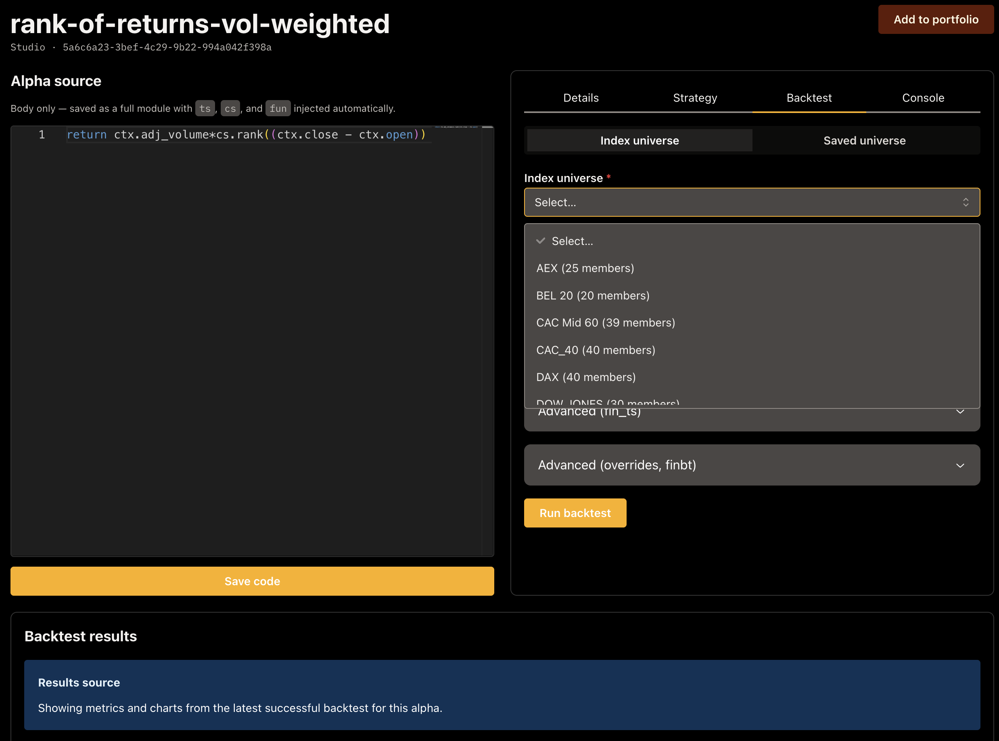
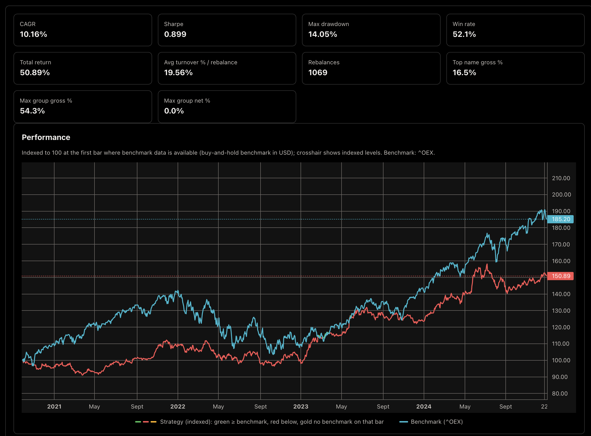
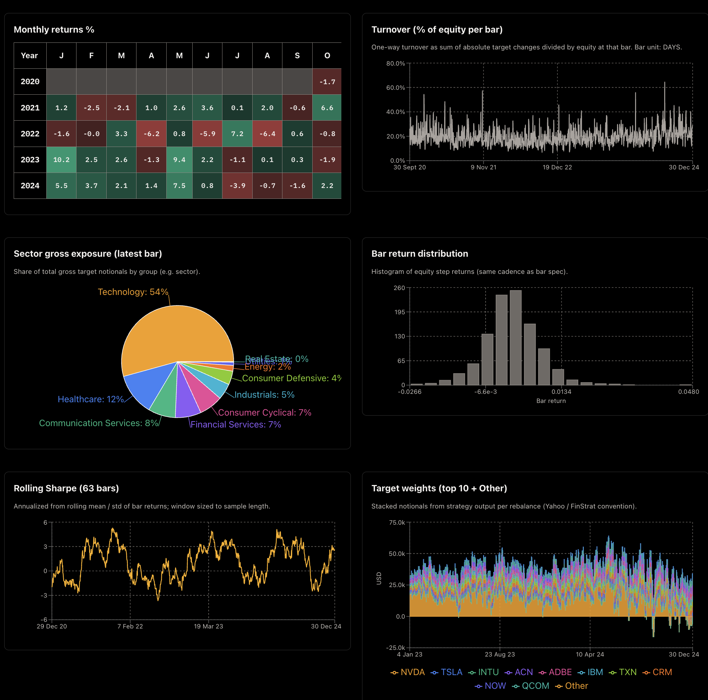

# Studio area (sidebar)

## Alpha Studio hub (`/studio`)

List and navigate alpha definitions stored via **`/alphas`**.

## New alpha (`/studio/new`)

Create a record with name, optional **`import_ref`**, optional inline **`source_code`**, and **FinStrat** JSON configuration.

## Workspace (`/studio/:alphaId`)

- **Monaco editor** for Python alpha body when using inline storage.
- **Lint** and **assist** call FastAPI (optional Ollama on the server).
- **Inline DSL** hints from `ui/src/alphaEditor/alphaDslCatalog.ts` (`ctx`, `ts`, `cs`, `fun`, `jnp`).
- **Enqueue backtest** from the workspace; results render below the editor when the job completes (metrics strip, optional AI review of numbers, Recharts / lightweight-charts tearsheets).
- **Default universe** — optional saved equity universe (`default_universe_id` on **`/alphas`**) used by the portfolio workspace union and as a convenience when configuring runs.

See [Alpha Studio: AI assist and DSL](../how-to/alpha-studio-ai-dsl.md) for Ollama env and DSL roots.

## Universes (`/universe`, `/universe/:id`)

Create and maintain saved universes (**`/universes`** API): members, sector/industry breakdown, fundamentals summary. Use them from **Backtests → New** (saved universe + benchmark) or add symbols from **Instrument** detail.

Universe detail splits into **Overview** (membership and summary cards) and **Risk & structure** (below).

### Risk & structure tab

Calls **`GET /universes/{id}/return-analytics`** using Timescale **daily** OHLCV; the card subtitle shows the aligned window. The UI offers lookback **1y / 2y / 5y**; the API accepts the same **`period`** values as instrument OHLCV history.

- **Return correlations** — tabs for **simple** vs **log** returns; square heatmap sized to the viewport **without** per-ticker row/column labels (hover a cell for the pair and Pearson **ρ**).
- **Cross-sectional volatility** — time series of cross-sectional standard deviation of simple returns.
- **PCA** — explained-variance bar, PC1 score over time, and **PC1 vs PC2 loadings** scatter (hover shows **ticker** and loadings).
- **Concentration** — HHI, CR5, CR10, weight mode; **top holdings** as one header row of tickers and one row of weights (scrolls horizontally when needed).

Other query parameters on the route (not all exposed in the UI) include **`interval`** (**`1d`** only), **`source`**, **`max_members`** (cap on names in the panel), and **`n_pca_components`**. See [HTTP API — Universe return analytics](../reference/http-api-package.md#universe-return-analytics).

## Backtests (`/backtests`, `/backtests/new`, `/backtests/:jobId`)

- **List** — job status and navigation to detail.
- **New** — configure and submit **`POST /backtests`** (index universe, saved **`universe_id`** + **`benchmark_ticker`**, or explicit ticker list per API rules).
- **Detail** — logs, charts, and payload when `succeeded`.

Example metrics strip and indexed performance vs benchmark on a succeeded job:

Secondary tearsheets (monthly returns heatmap, turnover, exposures, distributions, rolling Sharpe, stacked targets):

- **HTTP semantics** (fixed date window, `include_test_period_in_results`, index runs): [Backtest from the web UI](../how-to/backtest-from-ui.md).

## See also

- [FinStrat and FinBT](../documentation/finstrat-finbt.md) (code); [Alphas, metrics](../concepts/alphas-metrics-and-evaluation.md) (finance)
- [HTTP API (overview)](../reference/http-api-package.md)
