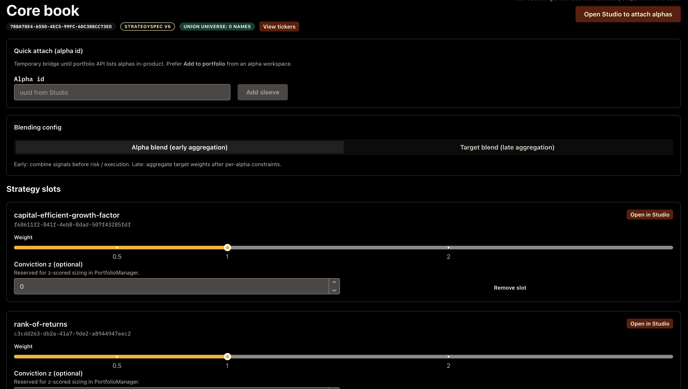
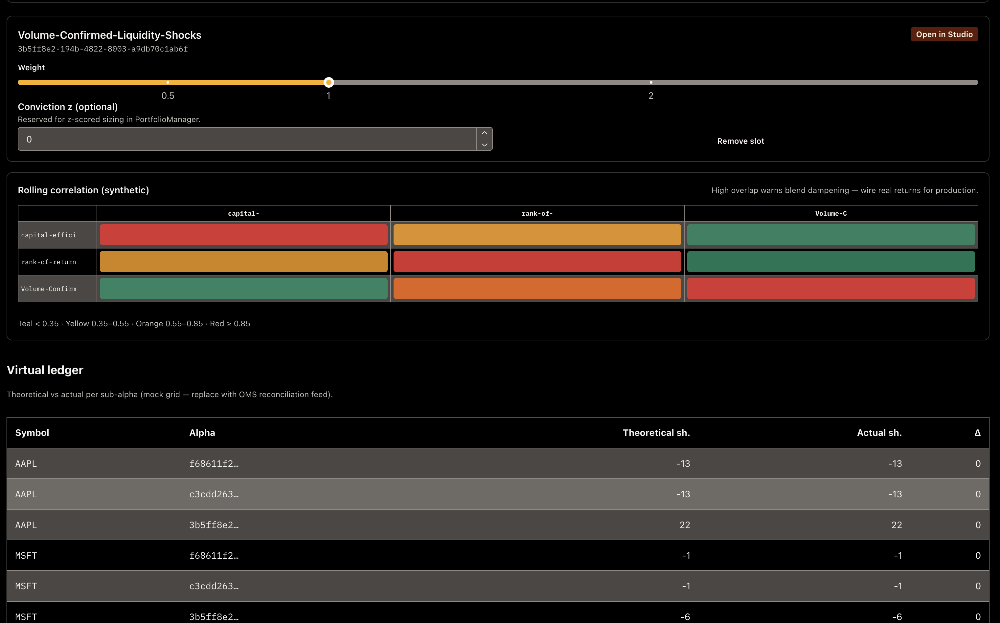
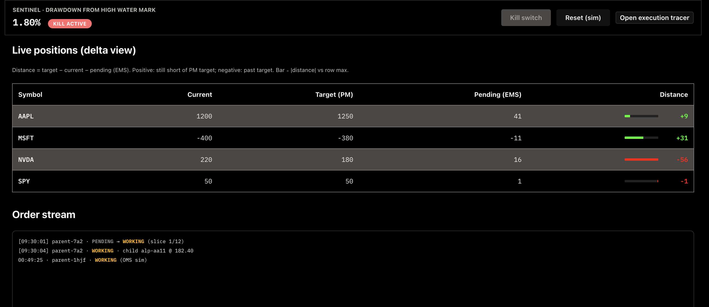
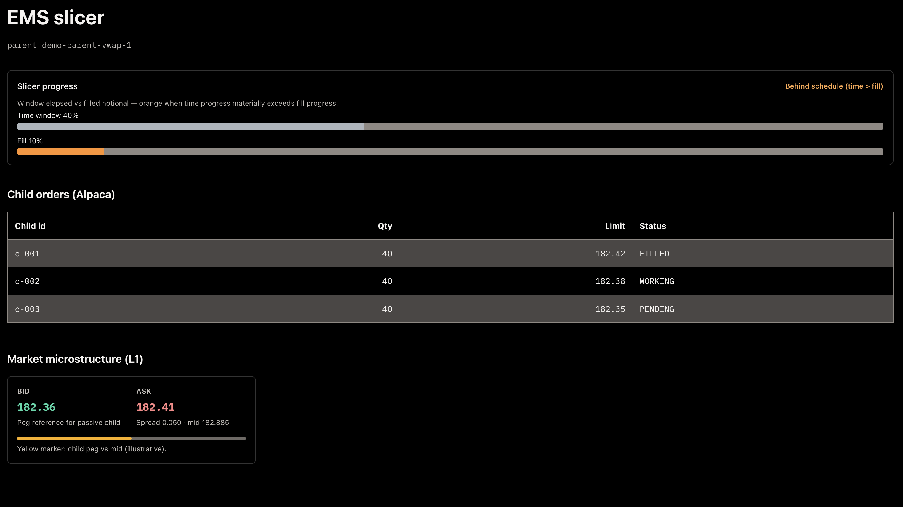

# Trade area (sidebar)

## Portfolios (`/portfolios`, `/portfolios/:id`)

Portfolio workspace: blend configurations and weights. State may combine API data with client-side persistence depending on route coverage; consult `ui/src/hooks/useTradeDesk.ts` and related components for current behavior.

Blend modes, quick attach by alpha id, and per-alpha weights (example **Core book** workspace):

Rolling correlation (synthetic overlap warning) and **virtual ledger** (mock grid until OMS reconciliation is wired):

## Live (`/live`)

Cockpit-style strip for live-style monitoring (layout oriented to trading workflows). **Sentinel** surfaces drawdown-from-high-water-mark, kill/reset controls, target vs current vs pending deltas, and an order stream (much of the desk still mixes **mock / `localStorage`** state with live API calls depending on route coverage).

## Account (`/trade/account`)

When the API has **`SHUNYA_API_ALPACA_ENABLED`** and keys configured, the UI can call:

- Equity snapshot
- Portfolio history
- Activities
- Account configurations (get/patch)

Send header **`X-Shunya-Trade-Desk-Token`** matching **`SHUNYA_API_TRADE_DESK_TOKEN`** on the API (paste the same value in **Settings** where provided). Without Alpaca + token, these calls fail or are gated by the API.

## Execution (`/execution`, `/execution/:parentId`)

**Execution hub** and **tracer** routes exist in the router; much of the **Trade** desk still uses **mock client state** in **`localStorage`** (`shunya_trade_desk_v1`) until additional live OMS/EMS HTTP APIs are exposed.

**EMS slicer** view (parent progress vs time window, child orders, L1 microstructure card) — illustrative / demo parent id in the capture:

## Risk (`/risk`)

**Risk command center** — limits and diagnostics UI backed by mock/local state in the same sense as Execution until server routes are expanded.

## Paper cycle (API)

One-shot institutional paper cycle is available at **`POST /trade/paper/cycle`** (not a full duplicate of the Account page). See [Paper trading cycle (API)](../how-to/paper-cycle-api.md).

## See also

- [OMS, EMS, and order routing](../concepts/oms-ems-and-order-routing.md) (finance) and [Execution: OMS, EMS](../documentation/oms-ems.md) (code)
- [HTTP API](../http-api.md)
